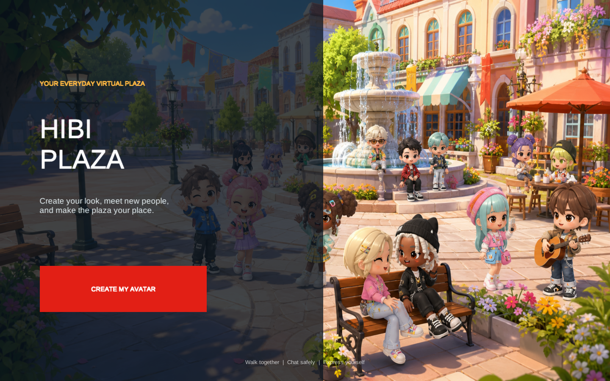
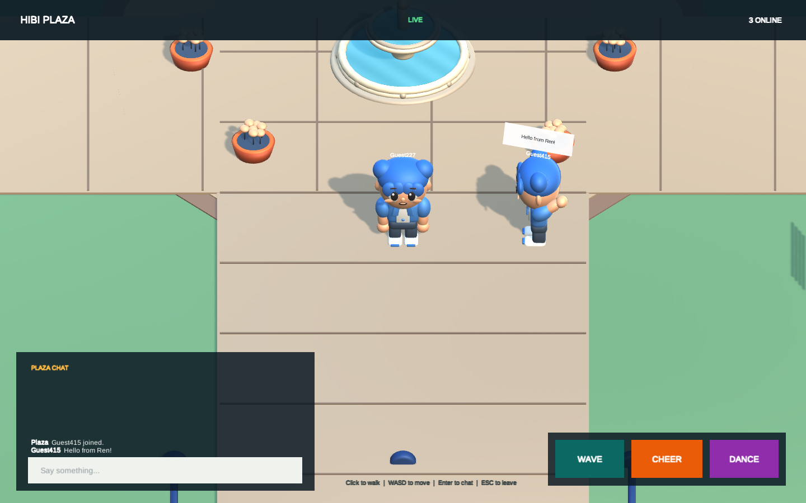
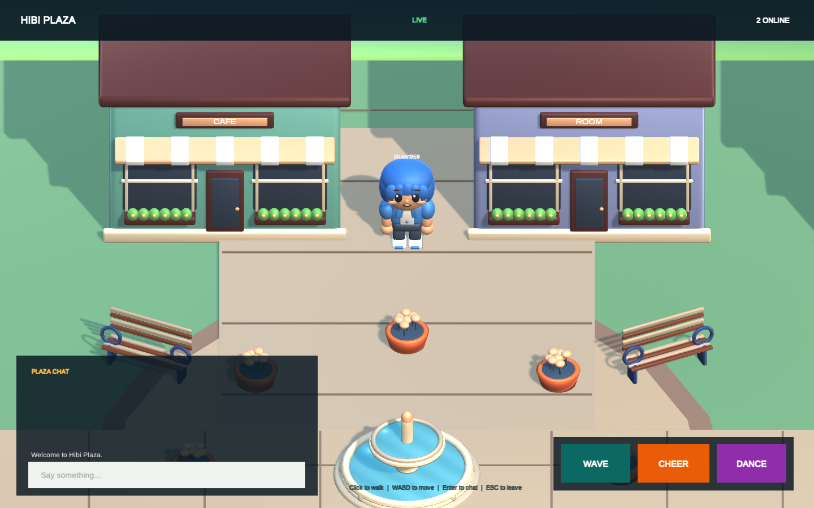

# Hibi Plaza

Hibi Plaza is an original 2.5D social virtual world built with Unity. Create a colorful avatar, walk around the plaza, meet other visitors, chat, and share quick emotes in real time.

**[Play Hibi Plaza in your browser](https://masafykun.github.io/hibi-plaza/)**



## Current Features

- Blender-built modular chibi avatars with detailed faces, layered hair, clothing, and shoes
- Avatar creator with skin, hair, four hairstyles, top, and bottom choices
- A stylized plaza with modeled fountain, shops, cafe furniture, trees, lamps, benches, and flower planters
- Click-to-walk and WASD movement
- Realtime multiplayer position and appearance sync
- Shared plaza chat with speech bubbles
- Wave, cheer, and dance emotes
- Offline preview residents when the network is unavailable
- Responsive WebGL presentation with a custom loading screen





## Controls

| Action | Input |
| --- | --- |
| Walk | Click the plaza or use WASD |
| Chat | Press Enter, type, then press Enter |
| Emote | Use the Wave, Cheer, or Dance buttons |
| Leave plaza | Escape |

## Project Layout

- `Assets/HibiPlaza` contains the Unity runtime, editor setup, shaders, scene, and artwork.
- `ArtSource/Blender` contains the editable asset library.
- `Tools/Blender` contains the deterministic asset-generation script.
- `Assets/WebGLTemplates/HibiPlaza` contains the custom WebGL shell.
- `Server` contains the small Node.js WebSocket service and integration test.
- `Deployment` contains the systemd and nginx production configuration.
- `docs` contains the GitHub Pages build.

## Development

Open the project with Unity `6000.0.77f1`. The editor menu under **Hibi Plaza** can configure the project, run the smoke test, and create the WebGL build.

The 3D library was created with Blender `5.1.2`. Running `Tools/Blender/generate_hibi_assets.py` in Blender background mode regenerates the avatar and eight optimized FBX asset groups plus a visual preview.

The realtime server requires Node.js 22 or newer:

```bash
cd Server
npm ci
npm test
npm start
```

The hosted client connects to `wss://hibi.160.251.234.247.nip.io/hibi`. The service validates message shape, limits movement/chat frequency, strips markup and control characters, and removes submitted links.

## Scope

This repository is a playable vertical slice and a foundation for a larger virtual world. Persistent accounts, rooms, inventories, moderation tools, and durable data storage are natural next milestones. Hibi Plaza is an original project and is not affiliated with Ameba Pigg or CyberAgent.

## License

Code is available under the [MIT License](LICENSE). The Hibi Plaza title artwork is included for use with this project.
